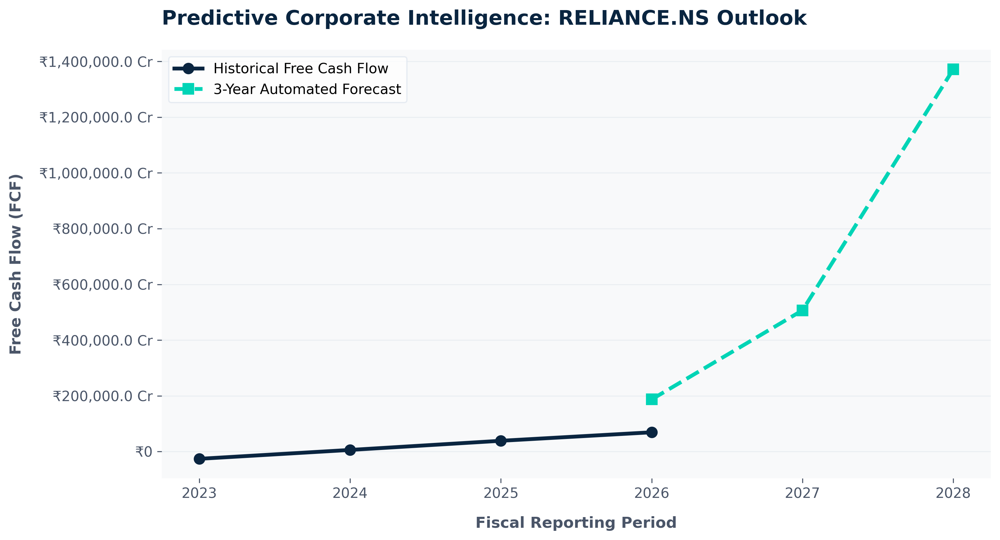

# Automated Equity Valuation Engine (Python)

An end-to-end financial intelligence engine built in Python designed to eliminate manual data gathering and automate long-term cash flow forecasting for publicly traded Indian equities.

## 🚀 Key Technical Architecture
* **Live Extraction Engine:** Leverages the `yfinance` library paired with dynamic string matching functions to clean and map incoming financial rows seamlessly.
* **Financial Metric Automation:** Processes multi-year historical Balance Sheets and Cash Flow statements to calculate trailing profit margins and isolate True Free Cash Flow ($FCF = \text{Operating Cash Flow} - \text{CapEx}$).
* **Predictive Forecasting:** Implements a compound annual growth rate matrix to run an automated 3-year out-of-sample forward horizon forecast.

## 📊 Visualized Analytics Output
The engine automatically structures scale anomalies (converting massive raw currency integers to absolute Crores) and outputs high-contrast visuals for immediate corporate review.

## 🛠️ How to Adapt This for Other Equities
The core framework is built dynamically. To run this script for any other large-cap NSE tracker:
1. Open the Jupyter Notebook file.
2. Change the `ticker` global assignment variable at the top (e.g., Change `"RELIANCE.NS"` to `"TCS.NS"` or `"INFY.NS"`).
3. Execute all cells to generate an updated analysis instantly.
